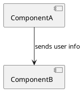
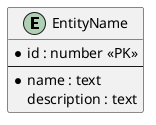
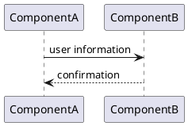

# Architecture Output Template

## File Path

`A4/<topic-slug>.arch.md`

## Frontmatter

```yaml
---
type: arch
pipeline: co-think
topic: "<topic>"
created: <YYYY-MM-DD HH:mm>
revised: <YYYY-MM-DD HH:mm>
revision: 0
status: draft | final
sources:
  - file: <topic-slug>.usecase.md
    revision: <usecase revision at time of reading>
    sha: <git hash-object output at time of reading>
reflected_files: []
tags: []
---
```

## Template

```markdown
# Architecture: <topic>
> Source: [<usecase-file-name>](./<usecase-file-name>)

## Overview
<Brief summary of the architecture approach, key decisions, and how it serves the use cases.>

## Technology Stack

| Category | Choice | Rationale |
|----------|--------|-----------|
| Language | <e.g., TypeScript> | <why> |
| Framework | <e.g., Next.js> | <why> |
| <other category> | <choice> | <why> |

---

## External Dependencies

| External System | Used By | Purpose | Access Pattern | Fallback |
|----------------|---------|---------|----------------|----------|
| <e.g., OAuth Provider> | UC-1, UC-2 | <purpose> | <how the system interacts> | <what happens if unavailable> |

<Text explanation of each dependency: what is sent/received, constraints, provider choice.>

---

## Component Diagram



<Text explanation of components and their responsibilities.>

## Components

### <Component Name>

**Responsibility:** <what this component does>
**Data store:** Yes / No

#### DB Schema *(only if Data store: Yes)*



<Text explanation of entities and relationships.>

#### Information Flow

##### Use Case: <UC reference>



<Text explanation of the flow for this use case.>

#### Interface Contracts

| Operation | Direction | Request | Response | Notes |
|-----------|-----------|---------|----------|-------|
| <operation name> | <ComponentA → ComponentB> | <request schema> | <response schema> | <e.g., event, sync, async> |

<Text explanation of the contracts.>

---

## Technology Choices

<Additional technology decisions beyond the Technology Stack (e.g., database, ORM, testing framework).>

| Choice | Decision | Rationale |
|--------|----------|-----------|
| <e.g., Database> | <e.g., PostgreSQL> | <rationale> |

---

## Test Strategy

| Tier | Tool | Purpose | Rationale |
|------|------|---------|-----------|
| Unit | <e.g., Vitest> | Component-internal logic | <why this tool> |
| Integration | <e.g., @vscode/test-electron> | Host environment APIs, component boundaries | <why this tool> |
| E2E | <e.g., WebdriverIO + wdio-vscode-service> | Full user interaction through UI | <why this tool> |

<Text explanation of the test strategy: what each tier covers, how they complement each other, any special setup considerations.>

---

## Consistency Check
<Results of cross-diagram and cross-area consistency check. Any gaps identified and how they were resolved.>

## Upstream Changes

<Domain Model modifications made to the usecase file during this architecture session. Only present if changes were made.>

| Source File | Section | Change | Reason |
|------------|---------|--------|--------|
| <slug>.usecase.md | Domain Model / Glossary | <what changed> | <why — discovered during which phase> |

---

## Open Items

| Section | Item | What's Missing | Priority |
|---------|------|---------------|----------|
| <section> | <item reference> | <specific gap description> | High / Medium / Low |

## Next Steps
- <suggested work items for next iteration>
```

## Required Sections

- Overview
- Technology Stack
- Component Diagram + Components (at least one)
- Test Strategy
- Open Items

## Conditional Sections

- External Dependencies — only if the system uses external services
- Technology Choices — only if additional choices beyond Technology Stack were made
- DB Schema (per component) — only if `Data store: Yes`
- Interface Contracts (per component boundary) — progressively filled across iterations; required for `status: final`
- Information Flow (per UC) — progressively filled; required for `status: final`
- Consistency Check — only if cross-area issues were found and resolved
- Upstream Changes — only if Domain Model was modified in the usecase file during this session
- Next Steps — only if the architecture is not yet finalized

## Diagram References

- **Class diagram (domain)**: [PlantUML Class Diagram](https://plantuml.com/class-diagram)
- **State diagram**: [PlantUML State Diagram](https://plantuml.com/state-machine-diagram)
- **Component diagram**: [PlantUML Component Diagram](https://plantuml.com/component-diagram)
- **Sequence diagram**: [PlantUML Sequence Diagram](https://plantuml.com/sequence-diagram)
- **IE diagram (DB schema)**: [PlantUML IE Diagram](https://plantuml.com/ie-diagram)
