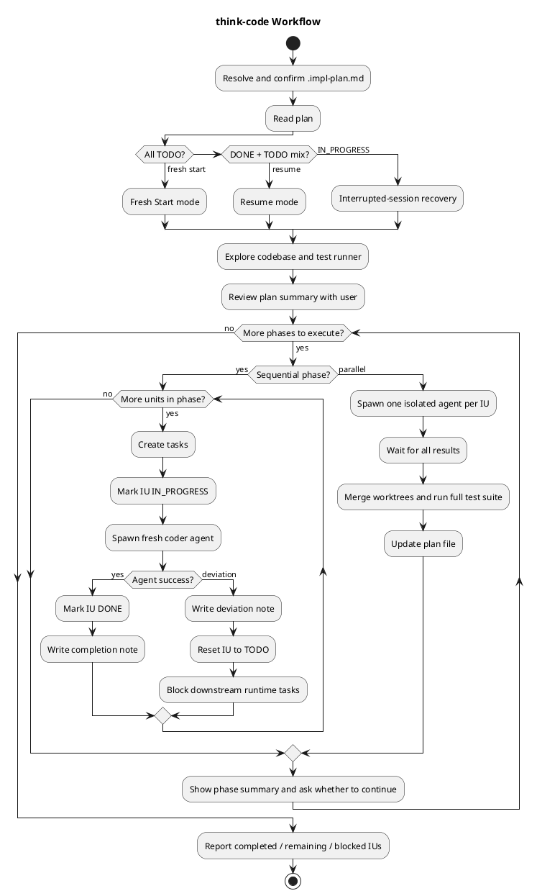

# think-code

Execute an implementation plan by orchestrating `coder` agents unit by unit.

## Workflow

## Agent Contract

| Input to agent | Output from agent |
|---|---|
| IU details, codebase context, recent completion notes, shared integration points | `success` or `deviation`, completion note, commit hash, or deviation details |

## Deviation Rule

Only escalate **plan vs reality mismatches**. Normal build/test failures stay within the agent's responsibility.
