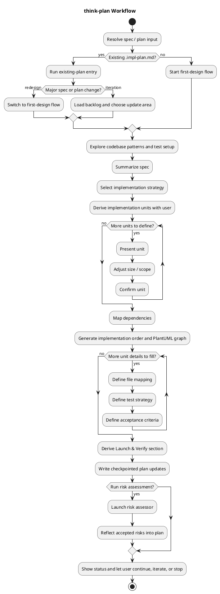

# think-plan

Collaboratively derive an implementation plan from a specification, including units, dependencies, file mappings, and verification strategy.

## Workflow

## Main Deliverables

- Ordered implementation units (IUs)
- Dependency graph + implementation order
- Per-IU file mappings, tests, acceptance criteria
- Launch & Verify section
- Optional reflected risk assessment

## Mode Split

- **First Design**: full flow from codebase exploration to risk assessment.
- **Iteration**: inspect spec changes, unreflected reports, and backlog before editing the plan.
