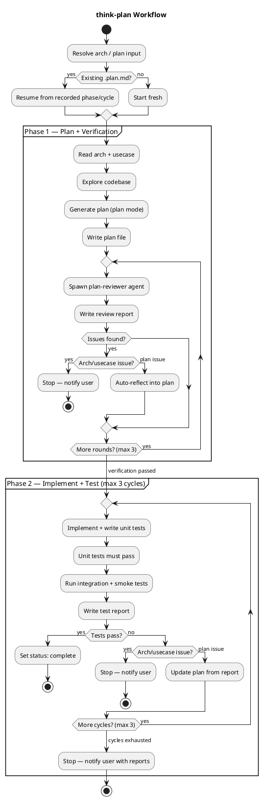

# think-plan

Autonomously generate an implementation plan from an architecture document, implement it, and iterate until integration and smoke tests pass.

## Workflow



## Main Deliverables

- Implementation plan (`.plan.md`) with IUs, dependency graph, test plan
- Working code with passing unit tests
- Integration + smoke test results
- Review and test reports for traceability

## File Structure

```
A4/<slug>.plan.md              — plan
A4/<slug>.plan.history.md      — event log (append-only)
A4/<slug>.plan.review-r<N>.md  — Phase 1 verification reports
A4/<slug>.test-report.c<N>.md  — Phase 2 test reports
```
