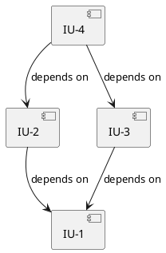

# Implementation Plan Output Template

## File Path

`A4/<topic-slug>.impl-plan.md`

## Frontmatter

```yaml
---
type: impl-plan
pipeline: co-think
topic: "<topic>"
created: <YYYY-MM-DD HH:mm>
revised: <YYYY-MM-DD HH:mm>
revision: 0
status: draft | final
sources:
  - file: <topic-slug>.spec.md
    revision: <spec revision at time of reading>
    sha: <git hash-object output at time of reading>
reflected_files: []
tags: []
---
```

## Template

```markdown
# Implementation Plan: <topic>
> Source: [<spec-file-name>](./<spec-file-name>)

## Overview
<Brief summary of what is being implemented, the scope, and overall approach. Reference the source spec.>

## Technology Stack
<Carry over from the spec's Technology Stack. Do not redefine — reference the spec for details.>

| Category | Choice |
|----------|--------|
| Language | <e.g., TypeScript> |
| Framework | <e.g., Next.js> |

## Implementation Strategy
<Overall approach to implementation. Key decisions about ordering, parallelism, and incremental delivery.>

- **Approach:** <e.g., bottom-up starting from data layer, or feature-by-feature vertical slices>
- **Incremental delivery:** <how to keep the system testable at each step>
- **Key constraints:** <anything from the spec that shapes implementation order>

---

## Implementation Units

### [IU-1]. <short title>

**FRs:** [FR-1], [FR-3]
**Components:** <ComponentA>, <ComponentB>
**Dependencies:** None | [IU-N], [IU-M]
**Status:** TODO | IN_PROGRESS | DONE

**Description:**
<What this unit implements. Reference specific FR behavior steps and component responsibilities. Be concrete — not "set up auth" but "implement JWT token generation and validation in AuthService, expose login endpoint with email/password input, return token on success and 401 on failure.">

**Files:**

| Action | Path | Change |
|--------|------|--------|
| Create | `src/services/auth.service.ts` | JWT generation, validation, login logic |
| Create | `src/models/user.ts` | User entity with email, passwordHash, createdAt |
| Modify | `src/app.ts` | Register auth routes |

**Test Strategy:**
- **Type:** <unit | integration | E2E>
- **Scenarios:**
  - <concrete scenario 1: input → expected output>
  - <concrete scenario 2: error case → expected error>
- **Isolation:** <mock/stub strategy for external dependencies, if any>
- **Test files:** `tests/services/auth.service.test.ts`

**Acceptance Criteria:**
- [ ] <measurable criterion derived from FR behavior — e.g., "POST /login with valid credentials returns 200 with JWT token">
- [ ] <error case — e.g., "POST /login with invalid password returns 401 with error message">

**Completion Note:**
<Written by think-code orchestrator on successful implementation. Records implementation decisions, minor deviations from plan, and rationale. Example:>
- <spec called for bcrypt but used argon2 — already in use by existing codebase>
- <added index on `email` column for login query performance>
- <test uses in-memory SQLite instead of PostgreSQL for faster execution>

**Deviation Note:**
<Written by think-code orchestrator when the agent reports a major deviation — the plan assumes something that doesn't hold in the actual codebase. Status is reset to TODO (retryable after plan revision). Example:>
- Issue: <Plan specifies OAuth2 with Google provider, but existing codebase uses SAML for all auth flows>
- Impact: <Cannot proceed without a design decision on auth coexistence>
- Decision: <user skipped (2026-04-09) — revisit after plan update>

---

### [IU-2]. <short title>
...

---

## Dependency Graph



<Text explanation of the implementation order and why this sequence makes sense. Note any units that can be implemented in parallel.>

### Implementation Order

| Phase | Units | Can Parallelize |
|-------|-------|-----------------|
| 1 | IU-1 | — |
| 2 | IU-2, IU-3 | Yes |
| 3 | IU-4 | — |

---

## Launch & Verify

| Item | Value |
|------|-------|
| App type | <e.g., Web app, VS Code Extension, CLI, API service, Electron app> |
| Build command | <e.g., `npm run compile`, `npm run build`, `cargo build`> |
| Launch command | <e.g., `npm run dev`, `code --extensionDevelopmentPath=.`, `npm start`> |
| Launch URL/view | <e.g., `http://localhost:3000`, "Visual Claude webview panel", N/A for CLI> |
| Verify tool | <e.g., Playwright CLI, WebdriverIO + wdio-vscode-service, computer-use MCP> |
| Verify fallback | <e.g., chrome MCP, computer-use MCP, manual> |
| Smoke scenario | <the single most basic user interaction — e.g., "type a message and see a response"> |

<Derived from the spec's Technology Stack and codebase exploration. Used by think-code for build verification and by think-verify for integration testing. Also serves as the user's guide for manual verification.>

---

## Shared Integration Points

| File | Integration Pattern | Contributing IUs |
|------|-------------------|-----------------|
| <path> | <how contributions from different IUs compose> | <IU-N: what it adds, IU-M: what it adds> |

<Text explanation of how shared files are coordinated across units. Each code-executor agent receives this table for files it touches, so it knows both its piece and the overall pattern.>

---

## Risk Assessment

| Risk | Impact | Likelihood | Mitigation | Affected Units |
|------|--------|------------|------------|----------------|
| <risk description> | High / Medium / Low | High / Medium / Low | <mitigation strategy> | IU-1, IU-3 |

---

## Open Items

| Section | Item | What's Missing | Priority |
|---------|------|---------------|----------|
| <section> | <item reference> | <specific gap description> | High / Medium / Low |

## Next Steps
- <suggested actions for implementation>
```

## Required Sections

- Overview
- Technology Stack (carried from spec)
- Implementation Strategy
- Implementation Units (at least one)
- Launch & Verify
- Dependency Graph (with Implementation Order table)
- Open Items

## Conditional Sections

- Shared Integration Points — only if any file appears in 3+ IUs' file mappings
- Risk Assessment — only if non-trivial risks are identified
- Next Steps — only if the plan is not yet finalized

## Unit ID Convention

Units are numbered sequentially: `IU-1`, `IU-2`, etc. IU stands for "Implementation Unit." Numbering does not imply implementation order — the Dependency Graph and Implementation Order table define the actual sequence.

## Diagram References

- **Dependency graph**: Use [PlantUML Component Diagram](https://plantuml.com/component-diagram) syntax with `-->` arrows for "depends on" relationships.

## Execution Tracking Fields

The following fields are used by `think-code` (the implementation executor skill) and are **optional** for plan authors:

- **Status** — `TODO` (default) | `IN_PROGRESS` | `DONE`. Managed by the think-code orchestrator during execution. Plan authors do not need to set this field.
- **Completion Note** — Written by the orchestrator after successful implementation. Records implementation decisions, minor deviations, and rationale.
- **Deviation Note** — Written by the orchestrator when the executing agent reports a major deviation (plan assumes something that doesn't hold in the actual codebase). Status is reset to `TODO` so the unit can be retried after plan revision.

> `BLOCKED` is not a plan file status. The think-code orchestrator derives blocked state at runtime from the dependency graph — it is tracked in the session's TaskList, not persisted in the plan file.
