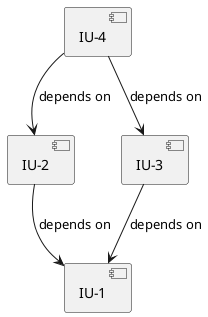

# Plan Output Template

## File Path

`a4/<topic-slug>.plan.md`

## Frontmatter

```yaml
---
type: plan
topic: "<topic>"
revision: 0
status: draft | verified | implementing | complete | blocked
phase: plan-review | implement | test
cycle: 1
sources:
  - file: <topic-slug>.arch.md
    sha: <git hash-object output at time of reading>
  - file: <topic-slug>.usecase.md
    sha: <git hash-object output at time of reading>
reflected_files: []
created: <YYYY-MM-DD HH:mm>
revised: <YYYY-MM-DD HH:mm>
---
```

## Template

```markdown
# Implementation Plan: <topic>
> Source: [<arch-file-name>](./<arch-file-name>), [<usecase-file-name>](./<usecase-file-name>)

## Overview
<Brief summary of what is being implemented, the scope, and overall approach. Reference the source architecture.>

## Technology Stack
<Carry over from the arch's Technology Stack. Do not redefine — reference the arch for details.>

| Category | Choice |
|----------|--------|
| Language | <e.g., TypeScript> |
| Framework | <e.g., Next.js> |

## Implementation Strategy
<Overall approach to implementation. Key decisions about ordering, parallelism, and incremental delivery.>

- **Approach:** <e.g., bottom-up starting from data layer, or feature-by-feature vertical slices>
- **Incremental delivery:** <how to keep the system testable at each step>
- **Key constraints:** <anything from the architecture that shapes implementation order>

---

## Implementation Units

### [IU-1]. <short title>

**FRs:** [FR-1], [FR-3]
**Components:** <ComponentA>, <ComponentB>
**Dependencies:** None | [IU-N], [IU-M]

**Description:**
<What this unit implements. Reference specific FR behavior steps and component responsibilities. Be concrete — not "set up auth" but "implement JWT token generation and validation in AuthService, expose login endpoint with email/password input, return token on success and 401 on failure.">

**Files:**

| Action | Path | Change |
|--------|------|--------|
| Create | `src/services/auth.service.ts` | JWT generation, validation, login logic |
| Create | `src/models/user.ts` | User entity with email, passwordHash, createdAt |
| Modify | `src/app.ts` | Register auth routes |

**Unit Test Strategy:**
- **Scenarios:**
  - <concrete scenario 1: input → expected output>
  - <concrete scenario 2: error case → expected error>
- **Isolation:** <mock/stub strategy for external dependencies, if any>
- **Test files:** `tests/services/auth.service.test.ts`

**Acceptance Criteria:**
- [ ] <measurable criterion derived from FR behavior — e.g., "POST /login with valid credentials returns 200 with JWT token">
- [ ] <error case — e.g., "POST /login with invalid password returns 401 with error message">

---

### [IU-2]. <short title>
...

---

## Dependency Graph



<Text explanation of the implementation order and why this sequence makes sense.>

### Implementation Order

| Phase | Units | Can Parallelize |
|-------|-------|-----------------|
| 1 | IU-1 | — |
| 2 | IU-2, IU-3 | Yes |
| 3 | IU-4 | — |

---

## Test Plan

### Unit Tests
<Covered per IU in their Unit Test Strategy sections above. All unit tests must pass before integration/smoke tests run.>

### Integration Tests

| Test | Description | Components Involved |
|------|-------------|---------------------|
| <test name> | <what it verifies across component boundaries> | <ComponentA, ComponentB> |

**Test files:** <path(s)>
**Runner command:** <e.g., `npm run test:integration`>

### Smoke Tests

| Test | Description | Verifies |
|------|-------------|----------|
| <test name> | <minimal end-to-end interaction> | <basic app functionality> |

**Runner command:** <e.g., `npm run test:smoke`>

---

## Launch & Verify

| Item | Value |
|------|-------|
| App type | <e.g., Web app, VS Code Extension, CLI, API service> |
| Build command | <e.g., `npm run build`> |
| Launch command | <e.g., `npm run dev`> |
| Launch URL/view | <e.g., `http://localhost:3000`> |
| Smoke scenario | <the single most basic user interaction> |

---

## Shared Integration Points

| File | Integration Pattern | Contributing IUs |
|------|-------------------|-----------------|
| <path> | <how contributions from different IUs compose> | <IU-N: what it adds, IU-M: what it adds> |

---

## Open Items

| Section | Item | What's Missing | Priority |
|---------|------|---------------|----------|
| <section> | <item reference> | <specific gap description> | High / Medium / Low |
```

## Required Sections

- Overview
- Technology Stack (carried from arch)
- Implementation Strategy
- Implementation Units (at least one)
- Dependency Graph (with Implementation Order table)
- Test Plan (unit + integration + smoke)
- Launch & Verify
- Open Items

## Conditional Sections

- Shared Integration Points — only if any file appears in 3+ IUs' file mappings

## Unit ID Convention

Units are numbered sequentially: `IU-1`, `IU-2`, etc. Numbering does not imply implementation order — the Dependency Graph and Implementation Order table define the actual sequence.
