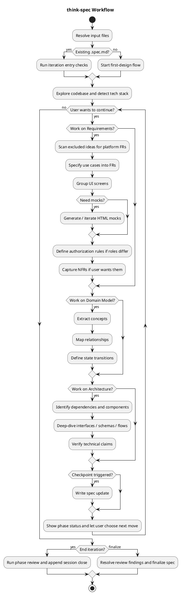

# think-spec

Collaboratively turn use cases into a buildable specification covering requirements, domain model, and architecture.

## Workflow

## Phase Structure

| Phase | Focus |
|------|-------|
| Requirements | FRs, screen groups, mocks, auth rules, NFRs |
| Domain Model | concepts, relationships, state transitions |
| Architecture | dependencies, components, schemas, interfaces |

## Key Rules

- Start from requirements in **First Design**, but allow jumping between phases.
- In **Iteration**, surface cross-phase impact whenever one phase changes.
- Keep abstraction boundaries: requirements = behavior, domain = concepts, architecture = interfaces/components.
