# think-usecase

A Socratic interviewer that helps users discover what to build through one-question-at-a-time dialogue. Progressively produces Use Cases — concrete descriptions of how users interact with the system, grounded in real situations.

## Current Notes

- **Primary file:** `plugins/think/skills/think-usecase/SKILL.md`
- **Current behavior:** Socratic use-case discovery skill. It writes and grows a working `.usecase.md`, checkpoints confirmed content, and can launch review / exploration support near wrap-up.

## Workflow

```plantuml
@startuml
title think-usecase Workflow

start

partition "Session Start" {
  if (Existing .usecase.md?) then (yes)
    :Iteration Mode
    (entry checks: unreflected reports,
    source changes, work backlog);
  else (no)
    :New Session;
    :Receive and restate idea;
    :Create working file;
  endif
}

partition "Discovery Loop" {
  repeat
    :Target gaps:
    What's happening now?
    Who's involved?
    What should change?
    What does success look like?;

    :Discover actors
    (person/system, role);

    partition "UC Extraction" {
      :Draft UC when context sufficient
      (Actor, Goal, Situation,
      Flow, Expected Outcome);
      :Present to user for confirmation;
      :Drill into precision
      (validation, error handling,
      boundary conditions);
      :Track via task;
    }

    :Check for UC splitting
    (too large?);

    if (Every 3 confirmed UCs) then (checkpoint)
      :Batch-write to file;
    else (continue)
    endif

    if (Sustained one direction?) then (yes)
      :Challenge mode shift
      (Contrarian / Simplifier / Reframer);
    else (no)
    endif

    if (3+ UCs and user agrees?) then (yes)
      :Similar Systems Research
      (background agent);
    else (no)
    endif

    if (5+ UCs confirmed?) then (yes)
      :Relationship Analysis
      (dependency, reinforcement, groups);
    else (no)
    endif

  repeat while (User continues?) is (yes) ->done;
}

partition "Platform Capabilities Audit" {
  :Scan UC flows for
  implicit shared behaviors;
  :Present assumed capabilities;
  :Create UCs for confirmed gaps;
}

partition "UI Screen Grouping" {
  if (UI use cases exist?) then (yes)
    :Group UCs by screen/view;
    :Define screen navigation;
    if (User wants mocks?) then (yes)
      :Mock Generation
      (per screen group via agent);
    else (no)
    endif
  else (no)
  endif
}

partition "Non-Functional Requirements" {
  if (User has NFRs?) then (yes)
    :Capture NFRs with
    affected UCs and criteria;
  else (no)
  endif
}

partition "Domain Model Extraction" {
  :Concept Extraction
  (entities across UCs);
  :Relationship Mapping
  (PlantUML class diagram);
  :State Transition Analysis
  (PlantUML state diagram);
}

partition "Wrap Up" {
  :Launch usecase-explorer agent;
  :Reflect accepted candidates;
  :Launch usecase-reviewer agent;
  :Walk through findings;
  :Update working file;
  :Append session close to history;
  :Suggest next step:
  think-arch;
}

stop

@enduml
```

