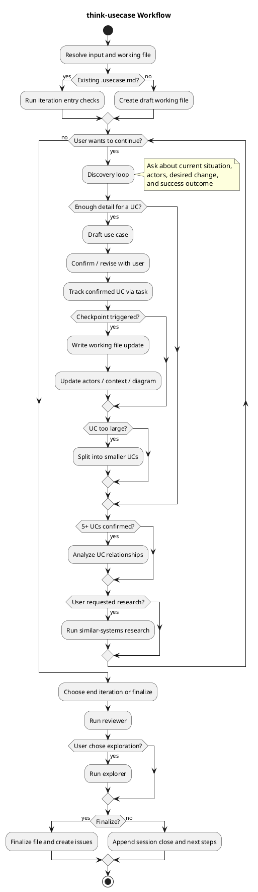

# think-usecase

Collaboratively turn an idea into concrete use cases through an interview-driven workflow.

## Workflow

## Core Flow

1. Resolve or create the `.usecase.md` working file.
2. Interview the user to uncover scenarios, actors, desired behavior, and outcomes.
3. Convert concrete scenarios into confirmed use cases.
4. Write checkpoint updates instead of rewriting on every turn.
5. Review at the end of the session, then optionally explore gaps or finalize.

## Key Side Flows

- **Iteration mode**: resume from an existing `.usecase.md` with entry checks.
- **Use case splitting**: break oversized UCs into smaller independent value slices.
- **Research**: only on request or explicit agreement.
- **Review / exploration**: reviewer first, explorer only if the user chooses it.
