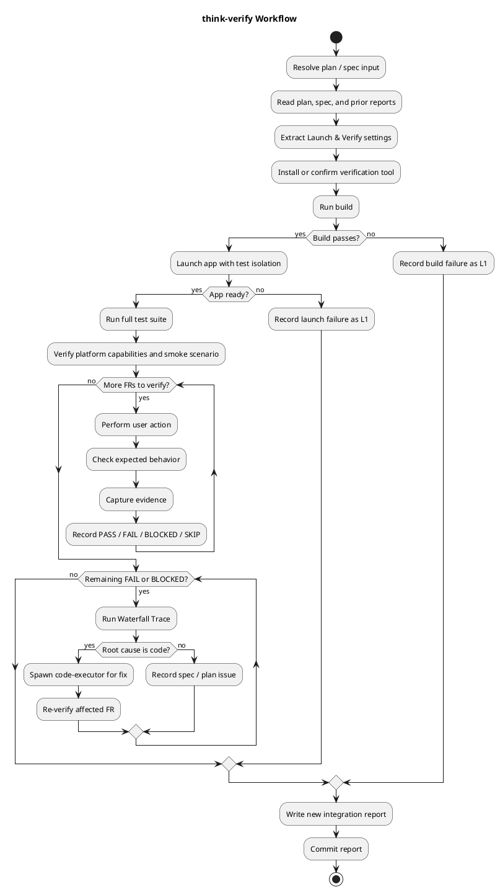

# think-verify

Verify the implemented system end-to-end against the plan and spec, then diagnose failures by stage.

## Workflow

## Diagnosis Waterfall

1. FR exists in spec?
2. IU covers FR in plan?
3. IU instructions are sufficient?
4. Code matches the IU?

The first failing check determines whether the issue belongs to **spec**, **plan**, or **code**.

## Output

A fresh `integration-report` file per run, including evidence, diagnosis, and auto-fix attempts.
