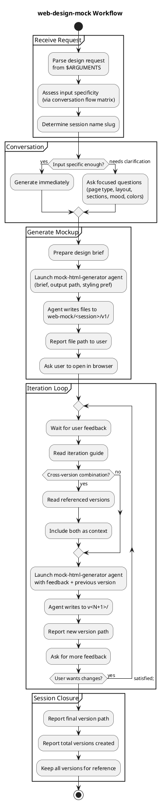

# web-design-mock

Orchestrates HTML mockup creation and iterates on designs based on user feedback. Manages conversation flow and delegates HTML/CSS generation to the mock-html-generator agent.

## Current Notes

- **Primary file:** `plugins/think/skills/web-design-mock/SKILL.md`
- **Current behavior:** Interactive mockup orchestrator. It manages versioned HTML/CSS outputs under `workflow/web-mock/<session>/vN/` and delegates generation to `mock-html-generator`.

## Workflow

