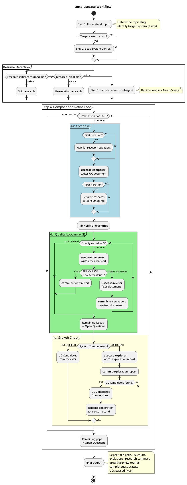

# auto-usecase

Autonomously generate a complete `.usecase.md` file from raw input without human interaction.

## Workflow

## Agents

| Agent | Role |
|-------|------|
| **usecase-composer** | Compose UC document from input + research |
| **usecase-reviewer** | Review UC quality + system completeness |
| **usecase-reviser** | Fix issues flagged by reviewer |
| **usecase-explorer** | Explore new perspectives for UC candidates |

## Loop Structure

- **Growth Loop** (outer, max 3): Compose → Quality → Growth Check
- **Quality Loop** (inner, max 3): Review → Revise until PASS
- **Growth Check**: System Completeness first, then Perspective Exploration

## Commit Points

| Timing | Contents |
|--------|----------|
| After compose (4b) | UC document |
| After each quality round (4c) | Review report (+ revised document if NEEDS REVISION) |
| After exploration (4d) | Exploration report |

## File Naming

| File | Pattern |
|------|---------|
| UC document | `<topic-slug>.usecase.md` |
| Research report | `<topic-slug>.usecase.research-initial.md` → `.consumed.md` |
| Review report | `<topic-slug>.usecase.review-g<iteration>-q<round>.md` |
| Exploration report | `<topic-slug>.usecase.exploration-<iteration>.md` → `.consumed.md` |

All files under `A4/co-think/`.
