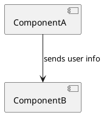
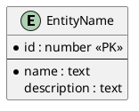
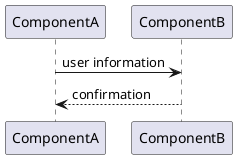

# Architecture Output Template

## File Path

`A4/co-think/<YYYY-MM-DD-HHmm>-<topic-slug>.architecture.md`

## Frontmatter

```yaml
---
type: architecture
pipeline: co-think
topic: "<topic>"
date: <YYYY-MM-DD>
status: final
revision: 0
last_revised:                    # omit until first revision
tags: []
---
```

## Template

```markdown
# Architecture: <topic>
> Source: [<story-file-name>](./<story-file-name>), [<requirement-file-name>](./<requirement-file-name>), [<domain-model-file-name>](./<domain-model-file-name>)

## Overview
<High-level architecture summary — what components exist, how they relate, key design decisions made during the session.>

## Technology Choices
<Decisions made during the session with brief rationale. Only present if choices were made.>

| Choice | Decision | Rationale |
|--------|----------|-----------|
| Database | PostgreSQL | Relational data, team experience |

## Component Diagram



<Text explanation of components and their responsibilities.>

## Components

### <Component Name>

**Responsibility:** <what this component does>
**Data store:** Yes / No

#### DB Schema *(only if Data store: Yes)*



<Text explanation of entities and relationships.>

#### Information Flow

##### Story: <story reference>



<Text explanation of the flow for this story.>

## Consistency Check
<Results of the consistency check against domain model and stories. Any gaps identified and how they were resolved.>

## Spec Feedback
- [FR-3], [FR-5]: <reason and explanation> → #<issue-number>
- [FR-1], [FR-3]: <reason and explanation> → #<issue-number>

## Interview Transcript
<details>
<summary>Full Q&A</summary>

### Round 1
**Q:** <question>
**A:** <answer>

...
</details>
```

**Issue reference links:** See [issue-links.md](../../references/issue-links.md). FR and STORY references use their canonical IDs (FR-1, STORY-1) throughout the document.

## Required Sections

- Overview
- Component Diagram
- Components (with per-component details)
- Consistency Check
- Interview Transcript

## Conditional Sections

- Technology Choices — only if choices were made during the session
- DB Schema (per component) — only if `Data store: Yes` for that component
- Spec Feedback — only if feedback issues were created during the session

## Diagram References

- **Component diagram**: [PlantUML Component Diagram](https://plantuml.com/component-diagram)
- **Sequence diagram**: [PlantUML Sequence Diagram](https://plantuml.com/sequence-diagram)
- **IE diagram (DB schema)**: [PlantUML IE Diagram](https://plantuml.com/ie-diagram)
