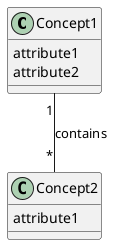
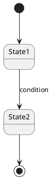

# Conceptual Model Builder

Takes functional specifications and extracts domain concepts through cross-cutting analysis. Through one-question-at-a-time dialogue, identify domain entities, their relationships, state transitions, and gaps in the specifications.

## Input

Read the spec file(s) provided: **$ARGUMENTS**

If no file is provided, ask the user for the path.

The `source` frontmatter field in the output file should contain wikilinks to the spec file(s) used as input (filename only, no path).

After reading, list all FRs found across all files and confirm with the user before proceeding.

## Step 0: Explore the Codebase

Before starting the conceptual model, explore the current codebase to understand:

- **Project structure** — directories, key files, tech stack
- **Existing features** — what's already built, patterns in use
- **Domain terms already in use** — naming conventions, existing entities, vocabulary

This grounds the conceptual model in reality. Reference what you find during the interview — e.g., "I see the codebase already uses the term 'Workspace' for grouping items. Should we align with that?"

## Conversation Topics

The conceptual model covers four topics. The user controls which topic to work on, when to switch, and when to revisit. Do NOT auto-advance to the next topic — always ask the user where they want to go next.

After completing work on any topic (or when the conversation reaches a natural pause), present the current status and ask:

> Here's where we are:
>
> | Topic | Status |
> |-------|--------|
> | Concept Extraction | 5 concepts defined |
> | Relationship Mapping | Not started |
> | State Transitions | Not started |
> | Spec Feedback | Not started |
>
> What would you like to work on next? We can continue here, move to another topic, or wrap up.

### Topic 1: Concept Extraction

- Read all FRs horizontally — identify concepts (entities) that appear across multiple FRs
- Present the initial concept list to the user
- For each concept, through interview confirm: name, definition, 1-2 key attributes
- Track which FRs reference each concept

### Topic 2: Relationship Mapping

- Identify relationships between concepts
- Present as PlantUML class diagram (concept name + key attributes only, NO implementation types)
- Accompanied by text explanation of each relationship
- Diagram should show multiplicity (1..*, 0..1, etc.) where relevant

### Topic 3: State Transition Analysis

- Identify which concepts have state changes across FRs
- For each stateful concept, map states, transitions, conditions, triggers
- Present as PlantUML state diagram
- For multi-entity processes, use composite states
- Accompanied by text explanation

### Topic 4: Spec Feedback (Dependencies/Conflicts/Gaps)

- Identify missing scenarios, contradictions, undefined edge cases across FRs
- Record as TODO checklist with checkboxes
- Each item must have: related FR numbers, clear reason why spec needs revision
- Format: `- [ ] FR-X, FR-Y: <reason and explanation>`

### Navigation Rules

The user controls all transitions, revisiting and interleaving are welcome. Example: "We've defined 6 concepts and covered all the FRs. Would you like to move to Relationship Mapping, or is there more to explore here?"

## Abstraction Level Guard

THIS IS CRITICAL — the key differentiator of this skill:

- The boundary is: "what exists and how it connects" = confirmed, "how to build it" = not decided
- If the user drifts into implementation (specific DB types, API endpoints, framework choices), redirect: "That's an implementation decision for the architecture phase. Here, let's focus on what [concept] means in the domain and how it relates to [other concept]."
- Do NOT include implementation types (VARCHAR, INT, etc.) in class diagrams
- Do NOT specify API endpoints or serialization formats in interfaces
- DO include: concept names, key attributes (without types), relationships, multiplicities, constraints, state transitions, conditions

## Progressive Conceptual Modeling

As concepts get clarified, update the working file progressively:

- After each concept is confirmed, update the glossary table and the file
- After relationships are mapped, add the class diagram
- After states are analyzed, add state diagrams
- Show progress: "That's 5 concepts defined, 3 relationships mapped. Let's continue."

## Facilitation Guidelines

- **Stay concrete.** Anchor to specific FRs, not abstract domain theory.
- **Use the user's language.** Don't introduce DDD jargon unless the user does.
- **Don't design the solution.** Capture what exists in the domain, not how to implement it.
- **Flag cross-spec dependencies.** If concepts span multiple spec files, note explicitly.
- **Every 3-4 concepts:** Brief progress snapshot.

## Wrapping Up

The conceptual model ends only when the user says so. Never conclude on your own — even if all concepts seem covered, the user may want to revisit or go deeper. Keep working until the user explicitly ends the session.

When the user indicates they're done:

1. **Run the domain-reviewer agent** — invoke the `domain-reviewer` agent with the current output file path. The agent evaluates every concept for completeness, definition clarity, relationship coverage, state transitions, diagram correctness, and spec feedback quality.
2. **Present the review results** — show the user the review report. For each flagged issue, walk through it one at a time:
   - `MISSING CONCEPT` — ask what the concept is and add it
   - `MISSING RELATIONSHIP` — propose the relationship and confirm
   - `MISSING STATE` — present the state transitions and confirm
   - `VAGUE TODO` — make the TODO more specific
   - The user can accept, modify, or dismiss each suggestion. Respect their decision.
3. **Update the output file** with any revisions from the review.
4. **Finalize the file** — change all glossary items to final, ensure all sections are complete.
5. **Show the Spec Feedback TODO list prominently.**
6. **Ask:** "These items need requirement revision. Would you like to run co-revise-requirement-with-domain to address them?"
7. **Write the file** using the Write tool.
8. **Report the path** so the user can reference it.

### Output Format

```markdown
---
type: domain
pipeline: co-think
topic: "<topic>"
date: <YYYY-MM-DD>
status: final
source:
  - "[[<spec-file-name>]]"
  - "[[<another-spec-file>]]"
tags: []
---
# Conceptual Model: <topic>

## Overview
<Domain summary — what concepts exist and how they connect at a high level. Derived from cross-cutting analysis of the FRs.>

## Domain Glossary

| Concept | Definition | Key Attributes | Related FRs |
|---------|-----------|----------------|-------------|
| <name>  | <definition> | <1-2 key attributes> | FR-1, FR-3 |

## Concept Relationships



<Text explanation of each relationship>

## State Transitions

### <Entity Name>



<Text explanation of states, transitions, and conditions>

## Spec Feedback
- [ ] FR-3, FR-5: <reason and explanation>
- [ ] FR-1, FR-3: <reason and explanation>

## Interview Transcript
<details>
<summary>Full Q&A</summary>

### Round 1
**Q:** <question>
**A:** <answer>

...
</details>
```

**`source` field rules:**
- Use wikilinks (filename only, no path) to the spec file(s) this model is based on.
- If multiple spec files, list all.

**Required sections**: Overview, Domain Glossary, Concept Relationships, State Transitions, Spec Feedback, Interview Transcript.

**File path**: `A4/co-think/<YYYY-MM-DD-HHmm>-<topic-slug>.domain.md`
