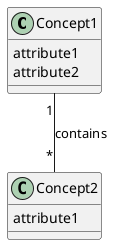
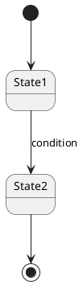

# Conceptual Model Output Template

## File Path

`A4/co-think/<YYYY-MM-DD-HHmm>-<topic-slug>.domain.md`

## Frontmatter

```yaml
---
type: domain
pipeline: co-think
topic: "<topic>"
date: <YYYY-MM-DD>
status: final
revision: 0
last_revised:                    # omit until first revision
source:
  - "[[<spec-file-name>]]"
  - "[[<another-spec-file>]]"
tags: []
---
```

**`source` field rules:**
- Use wikilinks (filename only, no path) to the spec file(s) this model is based on.
- If multiple spec files, list all.

## Template

```markdown
# Conceptual Model: <topic>

## Overview
<Domain summary — what concepts exist and how they connect at a high level. Derived from cross-cutting analysis of the FRs.>

## Domain Glossary

| Concept | Definition | Key Attributes | Related FRs |
|---------|-----------|----------------|-------------|
| <name>  | <definition> | <1-2 key attributes> | FR-1, FR-3 |

## Concept Relationships



<Text explanation of each relationship>

## State Transitions

### <Entity Name>



<Text explanation of states, transitions, and conditions>

## Spec Feedback
- FR-3, FR-5: <reason and explanation> → #<issue-number>
- FR-1, FR-3: <reason and explanation> → #<issue-number>

## Interview Transcript
<details>
<summary>Full Q&A</summary>

### Round 1
**Q:** <question>
**A:** <answer>

...
</details>
```

## Required Sections

- Overview
- Domain Glossary
- Concept Relationships
- State Transitions
- Spec Feedback
- Interview Transcript
