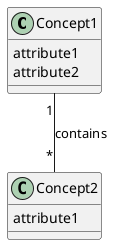
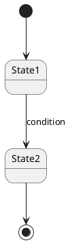

# Conceptual Model Output Template

## File Path

`A4/co-think/<YYYY-MM-DD-HHmm>-<topic-slug>.domain.md`

## Frontmatter

```yaml
---
type: domain
pipeline: co-think
topic: "<topic>"
date: <YYYY-MM-DD>
status: final
revision: 0
last_revised:                    # omit until first revision
tags: []
---
```

## Template

```markdown
# Conceptual Model: <topic>
> Source: [<spec-file-name>](./<spec-file-name>), [<another-spec-file>](./<another-spec-file>)

## Overview
<Domain summary — what concepts exist and how they connect at a high level. Derived from cross-cutting analysis of the FRs.>

## Domain Glossary

| Concept | Definition | Key Attributes | Related FRs |
|---------|-----------|----------------|-------------|
| <name>  | <definition> | <1-2 key attributes> | FR-1, FR-3 |

## Concept Relationships



<Text explanation of each relationship>

## State Transitions

### <Entity Name>



<Text explanation of states, transitions, and conditions>

## Spec Feedback
- FR-3, FR-5: <reason and explanation> → #<issue-number>
- FR-1, FR-3: <reason and explanation> → #<issue-number>

## Interview Transcript
<details>
<summary>Full Q&A</summary>

### Round 1
**Q:** <question>
**A:** <answer>

...
</details>
```

**Issue reference links:**
- FR and STORY references use their canonical IDs (FR-1, STORY-1) throughout the document.
- After GitHub Issues are created, add a references section at the end of the file mapping each ID to its GitHub issue URL:
  ```
  <!-- references -->
  [FR-1]: https://github.com/{owner}/{repo}/issues/45
  [STORY-1]: https://github.com/{owner}/{repo}/issues/7
  ```
- To make an ID clickable in GitHub file preview, write it as a markdown reference link `[FR-1]` or `[STORY-1]` in the body.

## Required Sections

- Overview
- Domain Glossary
- Concept Relationships
- State Transitions
- Spec Feedback
- Interview Transcript
