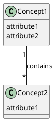
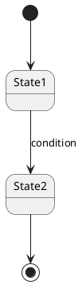
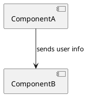
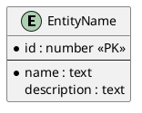
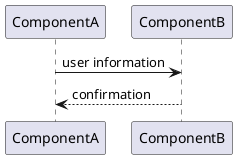

# Specification Output Template

## File Path

`A4/co-think/<topic-slug>.spec.md`

## Frontmatter

```yaml
---
type: spec
pipeline: co-think
topic: "<topic>"
created: <YYYY-MM-DD HH:mm>
revised: <YYYY-MM-DD HH:mm>
revision: 0
status: draft | final
covers:
  - <ui | non-ui>               # omit if not yet determined
tags: []
---
```

## Template

```markdown
# Specification: <topic>
> Source: [<story-file-name>](./<story-file-name>)

## Overview
<Brief summary of what this software does, who it's for, and the key design decisions. Updated as the spec grows across phases.>

---

## Functional Requirements

### Job Stories Reference
<List all Job Stories / Use Cases from the source file for traceability. If any were decomposed, show the sub-stories with a note referencing the original.>

### [FR-1]. <short title>
> Story: [STORY-1]

<!-- For UI -->
**Screen/View:** <where this happens>
**User action:** <what the user does>
**System behavior:**
1. <step 1>
2. <step 2>
...
**Validation:** <input rules, constraints>
**Error handling:** <what happens when things go wrong>
**Mock:** <path to mock HTML file, if created>

<!-- For Non-UI -->
**Trigger:** <what initiates this>
**Input:** <format, parameters, validation>
**Processing:** <business logic, rules, steps>
**Output:** <format, structure, response>
**Error handling:** <failure modes, error responses>

**Dependencies:** <other FRs this depends on, if any>

### [FR-2]. <short title>
> Story: [STORY-1], [STORY-2]
...

### Open Questions
<Unresolved decisions or ambiguities to revisit.>

---

## Domain Model

### Domain Glossary

| Concept | Definition | Key Attributes | Related FRs |
|---------|-----------|----------------|-------------|
| <name>  | <definition> | <1-2 key attributes> | [FR-1], [FR-3] |

### Concept Relationships



<Text explanation of each relationship>

### State Transitions

#### <Entity Name>



<Text explanation of states, transitions, and conditions>

---

## Architecture

### Technology Choices
<Decisions made during the session with brief rationale. Only present if choices were made.>

| Choice | Decision | Rationale |
|--------|----------|-----------|
| Database | PostgreSQL | Relational data, team experience |

### Component Diagram



<Text explanation of components and their responsibilities.>

### Components

#### <Component Name>

**Responsibility:** <what this component does>
**Data store:** Yes / No

##### DB Schema *(only if Data store: Yes)*



<Text explanation of entities and relationships.>

##### Information Flow

###### Story: <story reference>



<Text explanation of the flow for this story.>

### Consistency Check
<Results of cross-diagram and cross-phase consistency check. Any gaps identified and how they were resolved.>

---

## Spec Feedback
- [FR-3], [FR-5]: <reason and explanation> → #<issue-number>

## Change Log

| Date | Section | Change | Reason |
|------|---------|--------|--------|
| <YYYY-MM-DD> | <section> | <what changed> | <why> |

## Session Checkpoint
> Last updated: <YYYY-MM-DD HH:mm>

### Decisions Made
- <key decision>

### Open Items
- <undecided topic>

### Next Steps
- <what to work on next>

## Interview Transcript
<details>
<summary>Full Q&A</summary>

### Round 1
**Q:** <question>
**A:** <answer>

...
</details>
```

**Issue reference links:** See [issue-links.md](../../references/issue-links.md). FR and STORY references use their canonical IDs (FR-1, STORY-1) throughout the document.

## Required Sections

- Overview
- Functional Requirements (with Job Stories Reference)
- Domain Model (Glossary, Concept Relationships)
- Session Checkpoint
- Interview Transcript

## Conditional Sections

- State Transitions — only if stateful entities exist
- Architecture — only if the session reaches this phase
- Technology Choices — only if choices were made
- DB Schema (per component) — only if `Data store: Yes`
- Spec Feedback — only if feedback issues were created
- Change Log — only in Iteration mode
- Open Questions — only if unresolved topics remain

## Diagram References

- **Class diagram (domain)**: [PlantUML Class Diagram](https://plantuml.com/class-diagram)
- **State diagram**: [PlantUML State Diagram](https://plantuml.com/state-machine-diagram)
- **Component diagram**: [PlantUML Component Diagram](https://plantuml.com/component-diagram)
- **Sequence diagram**: [PlantUML Sequence Diagram](https://plantuml.com/sequence-diagram)
- **IE diagram (DB schema)**: [PlantUML IE Diagram](https://plantuml.com/ie-diagram)
