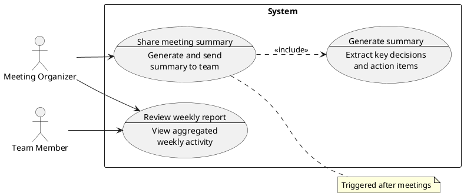

# Use Case Output Format

```markdown
---
type: usecase
pipeline: co-think
topic: "<topic>"
created: <YYYY-MM-DD HH:mm>
revised: <YYYY-MM-DD HH:mm>
revision: 0
status: draft | final
tags: []
---
# Use Cases: <topic>
> Source: [<brainstorm-file-name>](./<brainstorm-file-name>)

## Original Idea
<The original input, as-is.>

## Context
<Brief summary of the problem space, who's involved, and why this matters. Derived from the interview.>

## Actors

| Actor | Type | Role | Description |
|-------|------|------|-------------|
| <name> | person / system | <privilege level, e.g., admin, editor, viewer, — for system> | <who this person/system is and what they're trying to do> |

## Use Case Diagram



## Use Cases

### [UC-1]. <short title>
- **Actor:** <actor name from Actors table>
- **Goal:** <what the actor is trying to achieve>
- **Situation:** <context/trigger — when and why this happens>
- **Flow:**
  1. <user-level action step>
  2. <user-level action step>
  3. ...
- **Expected Outcome:** <what's different after the flow completes — observable/measurable>
- **Source:** <input | research — <which systems> | implicit> *(include when research was performed; omit otherwise)*

### [UC-2]. <short title>
- **Actor:** <actor name>
- **Goal:** <goal>
- **Situation:** <situation>
- **Flow:**
  1. ...
- **Expected Outcome:** <outcome>
- **Source:** <source> *(include when research was performed)*

### [UC-3]. <short title> *(split from original)*
#### [UC-3a]. <short title>
- **Actor:** <actor name>
- **Goal:** <goal>
- **Situation:** <situation>
- **Flow:**
  1. ...
- **Expected Outcome:** <outcome>

#### [UC-3b]. <short title>
- **Actor:** <actor name>
- **Goal:** <goal>
- **Situation:** <situation>
- **Flow:**
  1. ...
- **Expected Outcome:** <outcome>

...

## Use Case Relationships

*Not enough use cases for relationship analysis yet.*

### Dependencies
- **[UC-1] → [UC-2]**: <reason>

### Reinforcements
- **[UC-1] → [UC-2], [UC-3]**: <reason>

### Use Case Groups
| Group | Use Cases | Description |
|-------|-----------|-------------|
| <name> | [UC-1], [UC-2], ... | <description> |

## Similar Systems Research
*(include when research was performed; omit otherwise)*

<Brief summary of similar products researched and common feature patterns discovered.>

- **Similar systems:** <name — key features described as user goals> (up to 5 systems)
- **High-value UC candidates:** <features/goals appearing in 3+ systems>
- **Niche UC candidates:** <features found in only 1 system>
- **User-requested features:** <from reviews/forums>

## Excluded Ideas
*(Include when research was performed and candidates were excluded. Omit if nothing was excluded.)*

| UC Candidate | Source | Exclusion Reason | Usage Frequency | User Reach | Core Goal Contribution |
|-------------|--------|-----------------|-----------------|------------|----------------------|
| <candidate title> | input / research | <reason: outside system scope / overlaps UC-N / low practical value> | Routine / Rare | Majority / Subset | Direct / Tangential |

## Open Questions
<Questions that came up but weren't resolved. Topics to revisit.>
- ...

## Change Log

| Revision | Date | Section | Change | Reason |
|----------|------|---------|--------|--------|
| 1 | <YYYY-MM-DD> | <section> | <what changed> | <why> |

## Session Checkpoint (Revision <N>)
> Last updated: <YYYY-MM-DD HH:mm>

### Last Completed
- <what was just completed, e.g., "Initial composition", "Review round 1", "Revision 2 — 3 UCs added">

### Changes
- <what was added, fixed, or enriched>

### Decisions Made
- <key decision>

### Open Items

| Section | Item | What's Missing | Priority |
|---------|------|---------------|----------|
| <section> | <item reference> | <specific gap description> | High / Medium / Low |

### Next Steps
- <suggested work items for next iteration, derived from Open Items>

## Interview Transcript
<details>
<summary>Full Q&A</summary>

### Round 1
**Q:** <question>
**A:** <answer>

...
</details>
```

**Source rules:**
- Place source references as a blockquote directly under the title heading.
- Use relative path links for references within the same repo. Use full GitHub URLs only in issue bodies.
- If the idea came from a spark-brainstorm output file, add relative path links.
- If the idea came from multiple sources, list them comma-separated on one line.
- If the user provided a raw idea with no prior file, omit the source line entirely.

**Heading ID convention:**
- Use cases use `UC-N` IDs (UC-1, UC-2...) as canonical identifiers throughout the document.
- These IDs are assigned during the interview and remain unchanged at finalization.

**Use Case Diagram rules:**
- Use PlantUML use case diagram syntax.
- Show all actors and use cases with relationships (include/extend).
- Use PlantUML's multiline description syntax (`usecase UC1 as "Title\n--\nDescription"`) to show each use case's purpose at a glance.
- Add notes for additional context where helpful.
- Update the diagram each time a new use case is confirmed.

**Abstraction rule:**
- Flow steps must describe user-level actions only. No implementation terms (API, database, webhook, cache, queue, etc.).

**Issue reference links:** Read `${SKILL_DIR}/../../references/issue-links.md` for GitHub issue link formatting rules.

**Required sections (both skills)**: Original Idea, Context, Actors, Use Case Diagram, Use Cases, Use Case Relationships.
**Additional required (co-think-usecase)**: Session Checkpoint, Interview Transcript.
**Additional required (auto-usecase)**: Similar Systems Research, Open Questions, Session Checkpoint.
**Conditionally required:**
- **Similar Systems Research** — always in auto-usecase; in co-think-usecase only when research was performed
- **Source field** (per UC) — always in auto-usecase; in co-think-usecase only when research was performed
- **Open Questions** — if unresolved topics remain (co-think-usecase); always required (auto-usecase)
- **Change Log** — only when revision > 0; omit on first auto-usecase write
- **Excluded Ideas** — when research was performed and candidates were excluded; omit if nothing was excluded
**Sections to OMIT in auto-usecase:** Interview Transcript
